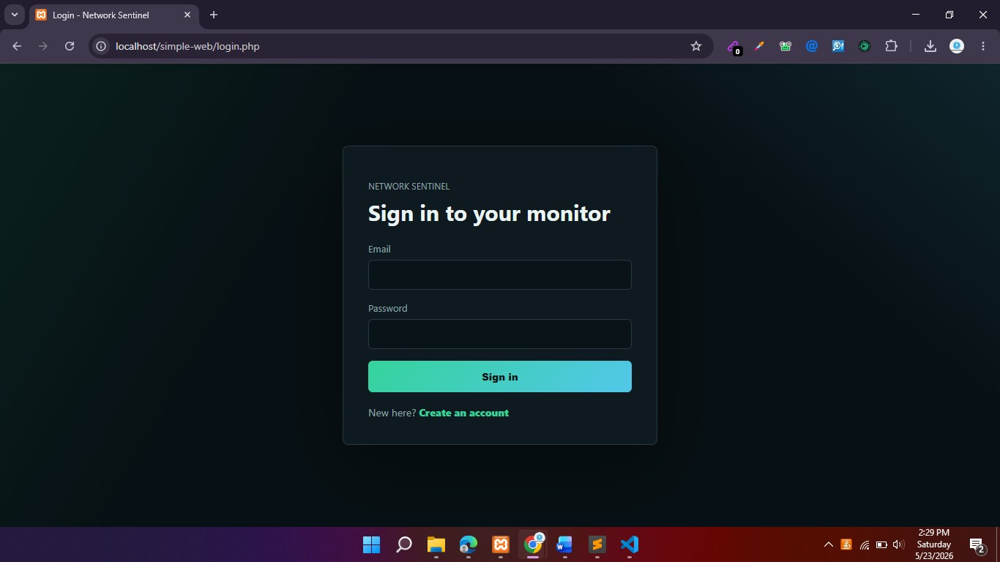
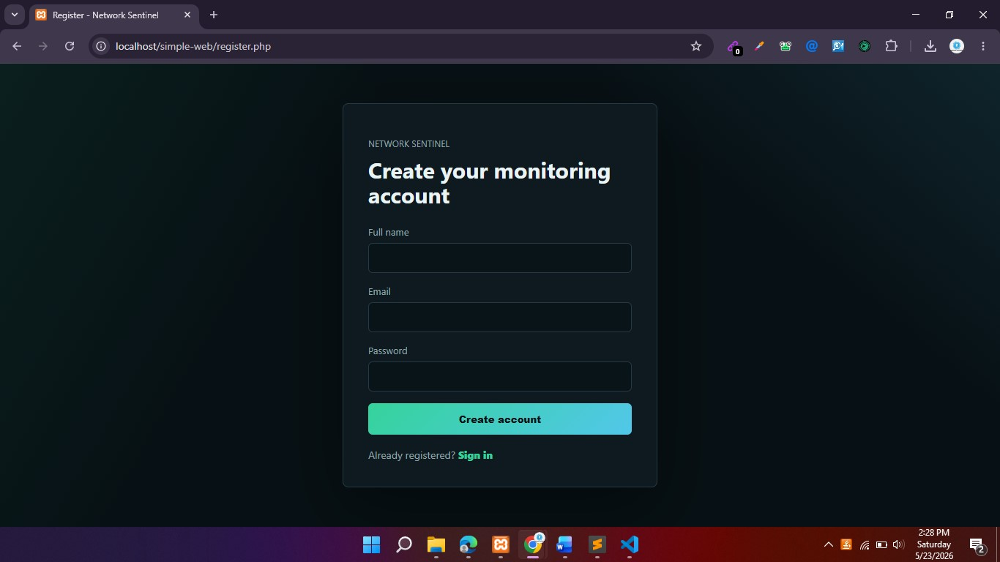
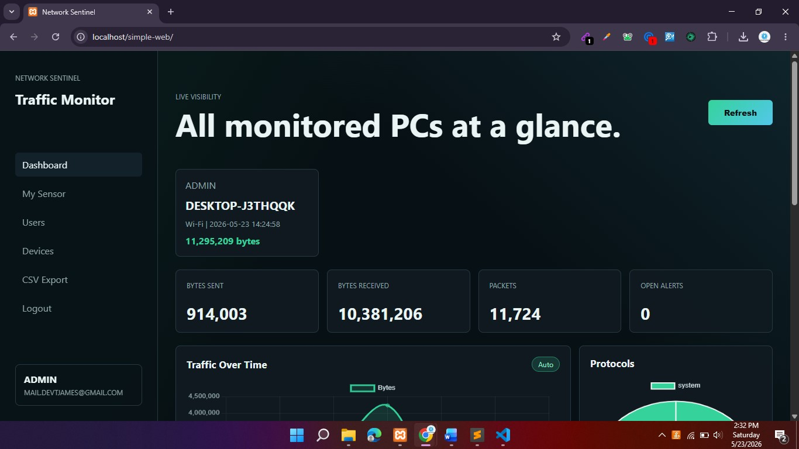
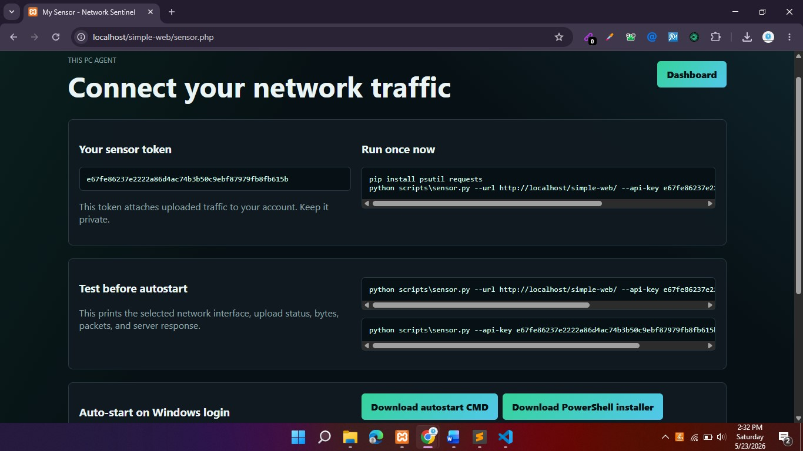
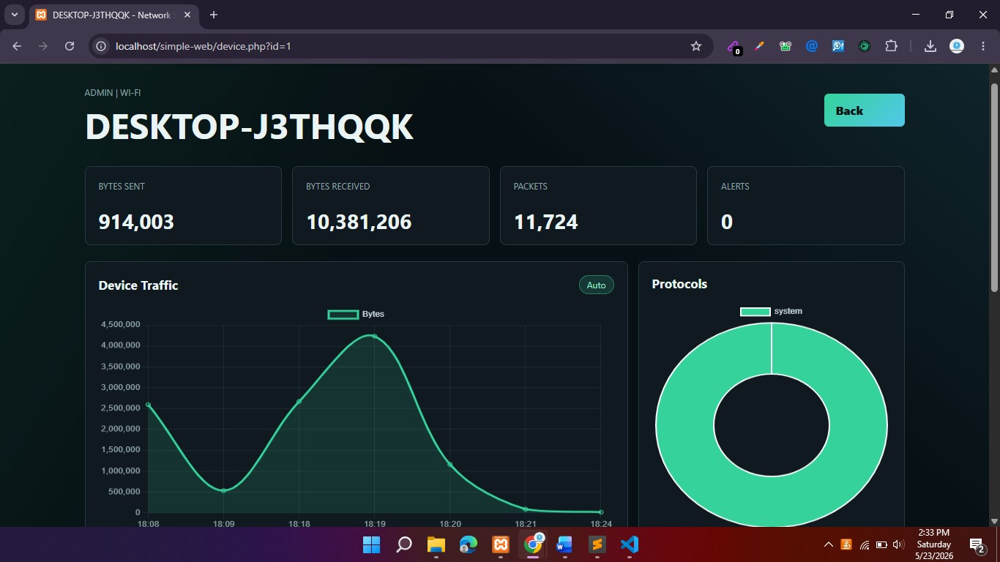
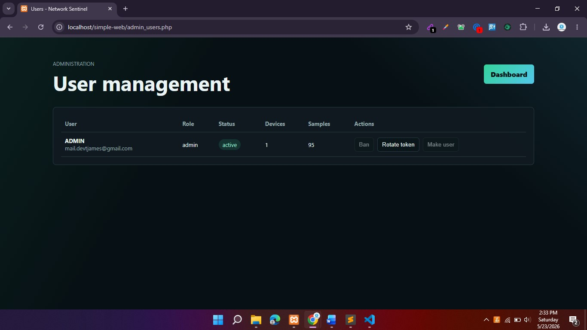

# Network Sentinel


Network Sentinel is a lightweight web-based network monitoring dashboard for local PCs. It uses a PHP and MySQL web app for authentication, dashboards, device management, alerts, and exports, plus an optional Python sensor that reports per-device traffic statistics.

This version is designed to run on a simple XAMPP/WAMP-style PHP stack. It does not require Docker, Redis, MinIO, or Nginx.

## Features

- User registration, login, and first-run admin setup
- Per-user sensor tokens for secure traffic uploads
- Live dashboard metrics with automatic refresh
- Recent traffic logs and alert views
- CSV export endpoint
- Admin controls for users, roles, bans, devices, and token rotation
- Optional Windows auto-start helper for the Python sensor
- Simple MySQL/MariaDB schema included in `database.sql`

## Screenshots

| Login | Registration |
| --- | --- |
|  |  |

| Dashboard | Sensor |
| --- | --- |
|  |  |

| Device Network | User Management |
| --- | --- |
|  |  |

## Tech Stack

- PHP 8.1+
- MySQL or MariaDB
- Apache through XAMPP/WAMP, or PHP's built-in development server
- Python 3.10+ for the optional traffic sensor
- `psutil` and `requests` for local sensor collection

## Requirements

Before running the project, make sure you have:

- PHP 8.1 or newer with PDO MySQL enabled
- MySQL or MariaDB
- Apache if you are using XAMPP/WAMP
- phpMyAdmin, Adminer, MySQL Workbench, or another database import tool
- Python 3.10 or newer if you want to run the traffic sensor

## Project Structure

```text
.
|-- database.sql
|-- public/
|   |-- index.php
|   |-- login.php
|   |-- register.php
|   |-- setup.php
|   |-- sensor.php
|   |-- admin_users.php
|   |-- devices.php
|   |-- device.php
|   |-- api/
|   |   |-- upload.php
|   |   |-- stats.php
|   |   |-- logs.php
|   |   |-- alerts.php
|   |   `-- export.php
|   `-- assets/
|-- scripts/
|   `-- sensor.py
|-- src/
|   |-- bootstrap.php
|   `-- config.php
`-- storage/
```

If your files are inside a `simple-web/` folder, treat that folder as the project root.

## Installation

### 1. Clone the repository

```bash
git clone https://github.com/YOUR_USERNAME/network-sentinel.git
cd network-sentinel
```

### 2. Create the database

Create a MySQL/MariaDB database named:

```sql
network_monitor
```

Then import `database.sql`.

With phpMyAdmin:

1. Start Apache and MySQL in XAMPP/WAMP.
2. Open `http://localhost/phpmyadmin`.
3. Create a database named `network_monitor`.
4. Open the database and click **Import**.
5. Select `database.sql`.
6. Click **Go**.

### 3. Configure database credentials

Open `src/config.php` and update the database settings if needed:

```php
const DB_HOST = 'localhost';
const DB_NAME = 'network_monitor';
const DB_USER = 'root';
const DB_PASSWORD = '';
```

The default values work for many local XAMPP installations.

## Running With XAMPP or WAMP

Copy the project folder into your local web root.

For XAMPP on Windows, that is usually:

```text
C:\xampp\htdocs\network-sentinel
```

Start Apache and MySQL, then open:

```text
http://localhost/network-sentinel
```

The included `.htaccess` file routes requests into the `public/` directory.

## Running With PHP's Built-in Server

From the project root, run:

```bash
php -S localhost:8000 -t public
```

Then open:

```text
http://localhost:8000
```

On first launch, the application will show a setup screen where you can create the first admin account.

## User Roles

The first account created during setup becomes an admin.

- Normal users can register publicly and view only their own PC traffic.
- Admin users can view all users, all PCs, device details, alerts, and logs.
- Admin users can ban or unban users, rotate sensor tokens, and change user roles.

## Running the Python Sensor

After logging in, open:

```text
/sensor.php
```

Copy your personal sensor token, then install the Python dependencies:

```bash
pip install psutil requests
```

Run the sensor:

```bash
python scripts/sensor.py --url http://localhost:8000 --api-key YOUR_PERSONAL_SENSOR_TOKEN
```

If you are using XAMPP/WAMP instead of the PHP development server, change the URL:

```bash
python scripts/sensor.py --url http://localhost/network-sentinel --api-key YOUR_PERSONAL_SENSOR_TOKEN
```

To list available network interfaces:

```bash
python scripts/sensor.py --api-key YOUR_PERSONAL_SENSOR_TOKEN --list-interfaces
```

Once the sensor is running, browse websites, stream video, download files, or run a speed test. The dashboard refreshes automatically.

## Windows Auto-start Sensor

The app includes helper downloads from `/sensor.php` for Windows users.

1. Log in to the web app.
2. Open `/sensor.php`.
3. Download the Windows auto-start script.
4. Right-click the script and run it with PowerShell.

The helper creates a Windows Scheduled Task that starts the Python sensor when you sign in.

If PowerShell closes immediately, use the CMD fallback installer from `/sensor.php`. The CMD installer pauses on errors and creates its local files in:

```text
%APPDATA%\NetworkSentinel
```

The installer creates its own private Python virtual environment:

```text
%APPDATA%\NetworkSentinel\.venv
```

To reset the auto-start setup, download and run the uninstall/reset helper from `/sensor.php`, then install the auto-start script again.

## Security Notes

- Keep `src/config.php` private and avoid committing production database credentials.
- Rotate a user's sensor token if it is exposed. Old sensor commands stop working immediately after rotation.
- Use HTTPS before deploying outside a trusted local network.
- Restrict database users to the minimum permissions required by the app.
- This project is intended for local or controlled environments unless you harden the deployment.

## Troubleshooting

### The app cannot connect to the database

Check that MySQL/MariaDB is running and that the credentials in `src/config.php` match your local database user.

### The dashboard has no traffic data

Make sure the Python sensor is running with the correct `--url` and `--api-key`. Also confirm that your sensor token has not been rotated.

### Apache shows the wrong page or a 404

Confirm that `.htaccess` is present and that Apache has `mod_rewrite` enabled.

### The sensor cannot install dependencies

Upgrade Python and pip, then install dependencies again:

```bash
python -m pip install --upgrade pip
pip install psutil requests
```

## Repository Notes

For a clean GitHub repository, commit the extracted project files instead of only uploading `network-sentinel.zip`. GitHub can display and track the source files properly when `database.sql`, `public/`, `scripts/`, and `src/` are present in the repository.


## Contact

If you want to discuss this project or review the code privately, feel free to reach out at: mail.devtjames@gmail.com
